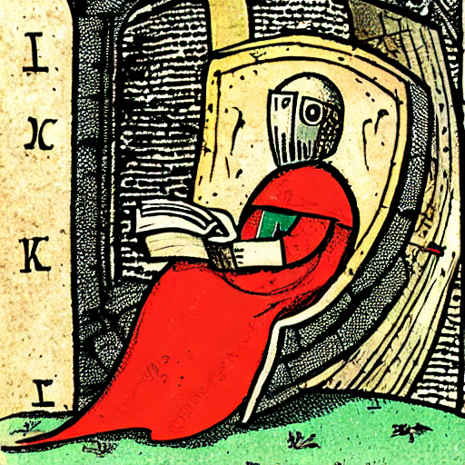
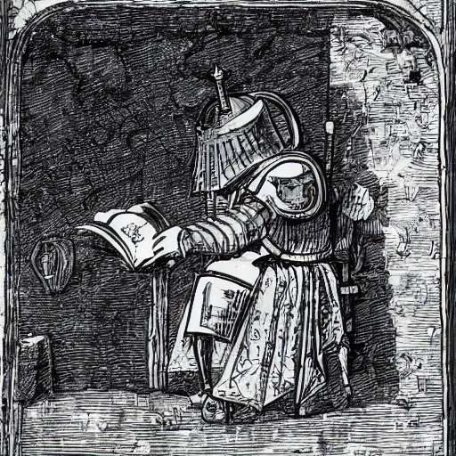
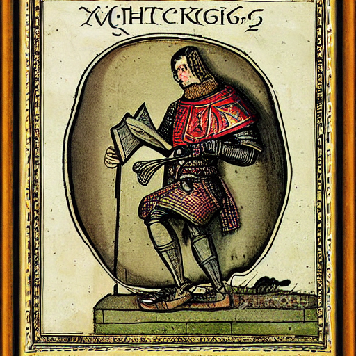
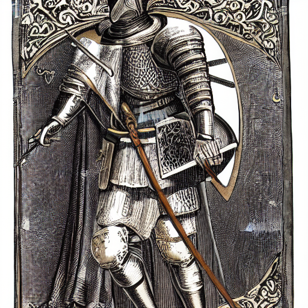
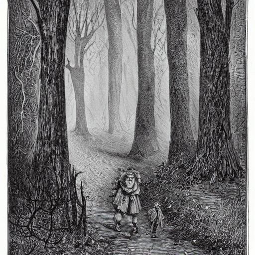
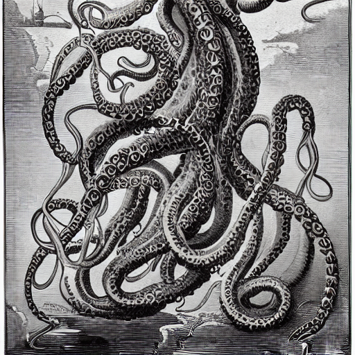
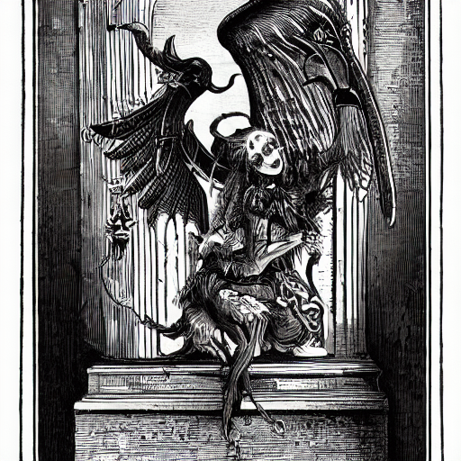
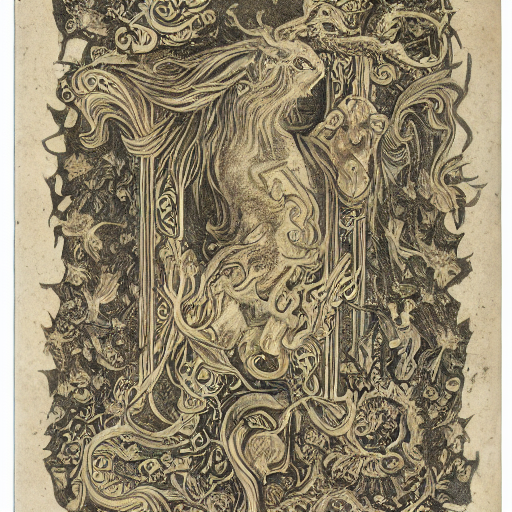

# Finetuning de Stable Diffusion v1.4 con el dataset *Old Book Illustrations*


Este proyecto corresponde a la entrega final del **Módulo Modelos de Generación de Imagen**.  
El objetivo es realizar un **finetuning completo** del modelo *Stable Diffusion v1.4* utilizando el dataset:

📚 **gigant/oldbookillustrations**  
https://huggingface.co/datasets/gigant/oldbookillustrations

El propósito es adaptar el modelo para que genere imágenes con el estilo visual característico de las ilustraciones de libros antiguos.

---

## 1. Descripción del proyecto

En clase se trabajó con el modelo `CompVis/stable-diffusion-v1-4` y se realizó un finetuning con un dataset de Pokémon.  
En esta entrega, se replica el proceso pero utilizando un dataset completamente distinto, con imágenes de ilustraciones antiguas.

El proyecto incluye:

- Carga y preprocesado del dataset.
- Transformaciones necesarias (crop, resize, normalización).
- Entrenamiento del modelo en **CPU**.
- Guardado del modelo finetuneado.
- Subida del modelo final a Hugging Face.
- Comparación visual entre el modelo base y el modelo finetuneado.
- Galería de imágenes generadas con distintos prompts para demostrar el trabajo exploratorio.

---

## 2. Dataset utilizado

El dataset contiene varias columnas, pero para el finetuning solo se utilizan:

- **`1600px`** → imagen en alta resolución  
- **`info_alt`** → descripción de la imagen

Las imágenes no son cuadradas, por lo que se aplican transformaciones de recorte y redimensionado para adaptarlas al tamaño requerido por Stable Diffusion.

---

## 3. Entrenamiento del modelo

El modelo base utilizado es:

🔗 **CompVis/stable-diffusion-v1-4**  
https://huggingface.co/CompVis/stable-diffusion-v1-4

Se entrenaron varias versiones del modelo, aumentando progresivamente los pasos y la resolución:

- `sd-oldbook-finetuned` → 50 steps, 256 px  
- `sd-oldbook-finetuned-256-100` → 100 steps, 256 px  
- `sd-oldbook-finetuned-512-100` → 100 steps, 512 px  
- **`sd-oldbook-finetuned-512-200` → 200 steps, 512 px (modelo final)**

El entrenamiento se realizó en **CPU**, con un tiempo aproximado de ~15 minutos por epoch en 50 steps, 256 px y hasta ~1 hora por epoch en 200 steps, 512 px (modelo final).

---

## 4. Modelo final en Hugging Face

👉 **https://huggingface.co/alexdesousa/sd-oldbook-finetuned-512-200**

Este es el modelo final utilizado para la comparación y la generación de imágenes.

---

## 5. Comparación visual (antes / después)

A continuación se muestra una comparación utilizando el mismo prompt:

> **“Medieval knight reading an ancient manuscript inside a stone chamber”**

### 🔹 Antes del finetuning (50 steps, 256 px)


### 🔹 Después del finetuning (50 steps, 256 px)


### 🔹 Antes del finetuning (200 steps, 512 px)


### 🔹 Después del finetuning (200 steps, 512 px)


> Se aprecia una mejora clara en estilo, sombreado, textura y coherencia visual.  
> El modelo final captura mucho mejor el estilo de grabado antiguo del dataset.

---

# 6. Galería de imágenes generadas durante el proceso

Estas imágenes muestran el trabajo exploratorio realizado con distintos prompts.  
Demuestran que se probaron múltiples configuraciones y prompts durante el desarrollo.

### Prompt: *"a haunting 19th century engraved illustration of a child walking through a shadowy forest"*


### Prompt: *"an antique engraved illustration of a colossal tentacled creature rising from stormy waters"*


### Prompt: *"an antique book engraving of a winged demonic figure perched atop a gothic bell tower"*


### Prompt: *"an antique book cover depicting mythical creatures, decorative borders"*


---

## 7. Uso del modelo finetuneado

```python
from diffusers import StableDiffusionPipeline
import torch

pipe = StableDiffusionPipeline.from_pretrained(
    "alexdesousa/sd-oldbook-finetuned-512-200",
    torch_dtype=torch.float32
)

prompt = "Medieval knight reading an ancient manuscript inside a stone chamber"
image = pipe(prompt).images[0]
image.save("modelo_Original.png")
```

---

## 8. Archivos incluidos en este repositorio

- `Finetuning_final_modulo_generacion_imagenes_SGPU.ipynb` → Notebook principal con el finetuning.    
- Comparación antes/después.  
- Galería de prompts.  
- `.gitignore` configurado para ignorar los modelos pesados (>3GB).  
- Archivo `.txt` con el enlace al modelo final en Hugging Face.

---

## Estado del proyecto: **Finalizado**
